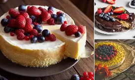

# 📚 GUÍA RÁPIDA - Dulce Encanto

> Tu primera página web - Consulta esta guía cuando lo necesites

---

## ESTRUCTURA DEL PROYECTO

```
Dulce-Delicia/
├── app.py                  ← Aplicación Flask y rutas principales
├── index.html              ← Frontend estático para GitHub Pages
├── templates/               ← Plantillas Jinja2 de Flask
│   ├── base.html
│   ├── index.html
│   ├── productos.html
│   ├── clientes.html
│   ├── proveedores.html
│   ├── facturacion.html
│   └── components/
│       ├── navbar.html
│       └── footer.html
├── static/                  ← CSS, JavaScript e imágenes
├── README.md               ← Información del proyecto
└── requirements.txt         ← Dependencia Flask
```

---

## 🎨 COLORES PRINCIPALES

| Color | Código | Uso |
|-------|--------|-----|
| **Azul Oscuro** | `#0a2540` | Encabezado, navegación, texto |
| **Azul Medio** | `#1d6fa5` | Botones hover |
| **Celeste** | `#3ba9e0` | Botones, acentos principales |
| **Fondo Claro** | `#f4faff` | Fondo general de la página |
| **Rojo Error** | `#dc3545` | Campos inválidos |
| **Verde Éxito** | `#28a745` | Campos válidos |

---

## 🔧 CAMBIOS MÁS COMUNES

### 1️⃣ CAMBIAR TÍTULO DEL SITIO
**Archivo:** `index.html` (línea ~15)
```html
<title>Dulce Encanto</title>  <!-- CAMBIAR AQUÍ -->
```

### 2️⃣ CAMBIAR ENCABEZADO PRINCIPAL
**Archivo:** `index.html` (línea ~30)
```html
<h1>Dulce Encanto</h1>
<p>Postres artesanales que endulzan tus momentos.</p>
```

### 3️⃣ CAMBIAR COLOR PRINCIPAL
**Archivo:** `css/estilo.css`
Busca `#3ba9e0` y reemplaza con tu color en formato HEX (ej: `#FF5733`)

### 4️⃣ CAMBIAR CORREO DE CONTACTO
**Archivo:** `index.html` (busca en la sección contacto)
```html
mailto:contacto@dulceencanto.com  <!-- CAMBIAR AQUÍ -->
```

### 5️⃣ CAMBIAR IMÁGENES
**Archivo:** `index.html`
```html
  <!-- Cambia la ruta -->
```

---

## 📝 CÓMO FUNCIONA EL FORMULARIO

### Validación en Tiempo Real
- **Nombre:** Mínimo 3 caracteres
- **Correo:** Formato válido (usuario@dominio.com)
- **Asunto:** Mínimo 5 caracteres
- **Mensaje:** Mínimo 10 caracteres

### Cambiar Requisitos de Validación
**Archivo:** `jss/script.js`

```javascript
// Cambiar línea ~33: NOMBRE MÍNIMO
if (valor.length < 3) {  // Cambiar el número 3
```

```javascript
// Cambiar línea ~100: ASUNTO MÍNIMO
if (valor.length < 5) {  // Cambiar el número 5
```

```javascript
// Cambiar línea ~115: MENSAJE MÍNIMO
if (valor.length < 10) {  // Cambiar el número 10
```

### Cambiar Tiempo de "Enviando..."
**Archivo:** `jss/script.js` (línea ~180)
```javascript
await new Promise(resolve => setTimeout(resolve, 1500));
// 1500 = 1.5 segundos | Cambiar para más o menos tiempo
```

---

## 🎯 VALIDACIÓN DEL FORMULARIO

### Estados de un campo:
1. **Rojo 🔴** = Error (inválido)
2. **Verde 🟢** = Correcto (válido)
3. **Naranja 🟠** = Advertencia (dominio no común)

### Cambiar mensaje de error
**Archivo:** `jss/script.js`
Busca texto de error como `"El nombre debe tener al menos 3 caracteres."` y reemplázalo

---

## 🔗 REDES SOCIALES

**Archivo:** `index.html` (busca la sección "También puedes contactarnos")

```html
<a href="mailto:contacto@dulcedelicia.com">📧 Correo</a>
<a href="https://instagram.com/dulceencanto">📱 Instagram</a>
<a href="https://wa.me/593900000000">💬 WhatsApp</a>
<a href="https://maps.google.com">📍 Ubicación</a>
```

**Para cambiar links:** Solo reemplaza el `href="..."` con la nueva URL

---

## 📱 DISEÑO RESPONSIVO

El sitio se adapta automáticamente a:
- **Escritorio:** 1920px y más
- **Tableta:** 768px - 1024px
- **Celular:** Menos de 480px

No necesitas cambiar nada, Bootstrap lo hace automáticamente.

---

## 🚀 CÓMO ABRIR LA PÁGINA

### Opción 1: Doble clic
Abre el archivo `index.html` con doble clic en el explorador de archivos

### Opción 2: Arrastrar a navegador
Arrastra el archivo `index.html` a tu navegador (Chrome, Firefox, Edge, etc.)

### Opción 3: Click derecho
Click derecho en `index.html` → "Abrir con" → Tu navegador favorito

---

## 💻 TECNOLOGÍAS UTILIZADAS

| Tecnología | Uso |
|------------|-----|
| **HTML5** | Estructura de la página |
| **CSS3** | Diseño y estilos visuales |
| **Bootstrap 5** | Framework para diseño responsive |
| **JavaScript** | Validaciones del formulario |
| **Google Fonts** | Tipografía personalizada |

---

## 🎓 CONCEPTOS CLAVE

### HTML
- `<tag>` = Etiquetas que estructuran el contenido
- `<h1>`, `<h2>`, etc. = Encabezados
- `<p>` = Párrafo
- `<button>` = Botón
- `<form>`, `<input>` = Formulario

### CSS
- `.clase` = Selector por clase
- `#id` = Selector por ID
- `color:` = Propiedad de color
- `background:` = Fondo
- `padding:`, `margin:` = Espacios

### JavaScript
- `addEventListener` = Escuchar evento (click, input, etc.)
- `getElementById` = Seleccionar elemento por ID
- `classList.add()` = Agregar clase CSS
- `async/await` = Esperar a que termine algo
- `fetch()` = Enviar datos a un servidor

---

## ❓ PREGUNTAS FRECUENTES

### ¿Cómo cambio el color de los botones?
Busca `#3ba9e0` en `css/estilo.css` y reemplázalo

### ¿Cómo agrego más productos?
Copia una tarjeta en `index.html` y cambia el contenido:
```html
<article class="col-md-4">
  <div class="card">
    
    <div class="card-body">
      <h3>Nombre Producto</h3>
      <p>Descripción</p>
      <a href="#contacto" class="btn btn-verde">Ordenar</a>
    </div>
  </div>
</article>
```

### ¿Cómo hago que el formulario envíe correos reales?
Necesitas un backend (servidor). Por ahora simula el envío.
Puedes usar: FormSubmit.co, Emailjs, o tu propio servidor

### ¿Cómo cambio el video de YouTube?
Busca el `iframe` en `index.html` y cambia el `src="..."` con tu video

### ¿Cómo agrego un logo en lugar del texto?
```html

```

---

## 📞 CONTACTO (PARA CAMBIAR)
- **Correo:** contacto@dulceencanto.com
- **WhatsApp:** +593 9 XXXXXXXX
- **Instagram:** @dulceencanto

---

## ✨ CONSEJOS

1. **Siempre guarda** después de hacer cambios (Ctrl+S)
2. **Recarga la página** después de cambios en CSS/JS (F5)
3. **Prueba en móvil** para ver cómo se ve (F12 en navegador)
4. **Usa comentarios** si modificas el código para recordar qué cambió
5. **Haz backup** de tus archivos importantes

---

## 📚 RECURSOS

- [Bootstrap Documentación](https://getbootstrap.com/docs/)
- [CSS Tutorial](https://www.w3schools.com/css/)
- [JavaScript Tutorial](https://www.w3schools.com/js/)
- [HTML Tutorial](https://www.w3schools.com/html/)

---

**¡Espero que disfrutes tu primera página web! **

Última actualización: 2026-07-03
